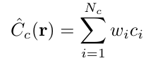

물론입니다! 먼저 해당 부분을 해석하면 다음과 같습니다:

주어진 식은 광선을 따라 샘플링된 색상들의 가중치 합으로 "대략적인" 네트워크에서 계산된 색상 \( \hat{C}_c(r) \)를 표현합니다. 이 때 각 색상 \( c_i \)는 해당 샘플링 위치에서의 색상 값을 의미합니다.

이 식에서, \( \hat{C}_c(r) \)는 광선을 따라 샘플링된 색상들의 가중치 합으로 계산된 색상이며, \( N_f \)는 "대략적인" 네트워크를 평가하는 데 사용된 샘플의 수를 나타냅니다.

각 샘플링 위치에서의 가중치 \( \hat{w}_i \)는 다음과 같이 계산됩니다:

여기서:
- \( T_i \)는 이전 샘플링 위치까지의 누적 투명도(또는 샘플링 위치까지의 광선 통과 정도)를 나타냅니다.
- \( \exp({-\sigma_i \delta_i}) \)는 해당 샘플링 위치에서의 물체의 투명도와 그 위치에서의 광선의 이동 거리를 나타냅니다. 
- \( \sigma_i \)는 해당 위치에서의 물체의 투명도를, \( \delta_i \)는 광선의 이동 거리를 나타냅니다.

따라서 \( \hat{w}_i \)는 해당 샘플링 위치에서의 색상이 최종적으로 계산된 색상 \( \hat{C}_f \)에 얼마나 큰 영향을 미치는지를 나타내는 가중치입니다. 

간단히 말하면, 이 식은 광선을 따라 여러 위치에서 샘플링된 색상들을 통합하여 하나의 색상을 얻기 위한 방법을 나타냅니다. 여기서 각 위치의 색상이 최종 색상에 얼마나 큰 영향을 미치는지는 해당 위치의 가중치에 따라 다릅니다.

-----------

이 공식은 각 샘플링 위치에서의 가중치 \( \w_i \)를 정규화하는 것을 나타냅니다.

여기서:

- \( \hat{w}_i \)는 정규화된 가중치입니다.
- \( w_i \)는 해당 위치에서의 원래 가중치입니다.
- \( \sum_{j=1}^{N_c} w_j \)는 모든 샘플링 위치에서의 가중치의 합입니다.

이 정규화 과정을 통해, 모든 정규화된 가중치 \( \hat{w}_i \)의 합은 1이 됩니다. 이렇게 함으로써, 각 샘플링 위치에서의 가중치가 전체 중 얼마나 차지하는지를 비율로 나타낼 수 있습니다. 

간단히 말하면, 이 공식은 각 샘플링 위치에서의 가중치가 전체 가중치 중 얼마나 큰 비중을 차지하는지를 계산하는 것입니다.

설명:
- 연구자들은 장면을 표현하기 위해 두 개의 다른 신경망을 동시에 사용합니다: "대략적인" 네트워크와 "정밀한" 네트워크입니다.
- 초기 단계에서는 "대략적인" 네트워크를 사용하여 특정 위치들의 값을 평가합니다.
- 이 "대략적인" 네트워크의 결과를 기반으로, 각 광선을 따라 더 잘 알려진 포인트들을 샘플링합니다. 이 샘플링은 볼륨 내의 더 중요한 부분에 중점을 둡니다.
- "대략적인" 네트워크의 출력을 통해 계산된 색상은 광선을 따라 샘플링된 모든 색상의 가중치 합으로 표현됩니다.
- 이 가중치는 정규화되어 광선을 따라 일정한 확률밀도함수를 형성합니다.
- 이 확률밀도함수를 기반으로, "정밀한" 네트워크는 두 번째 샘플 집합을 평가하여 최종 렌더링된 이미지를 얻습니다. 
- 전반적으로, 이 접근 방식은 보이는 부분에 더 많은 샘플을 할당하여 렌더링 효율성을 높입니다.

