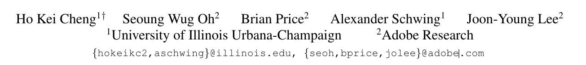
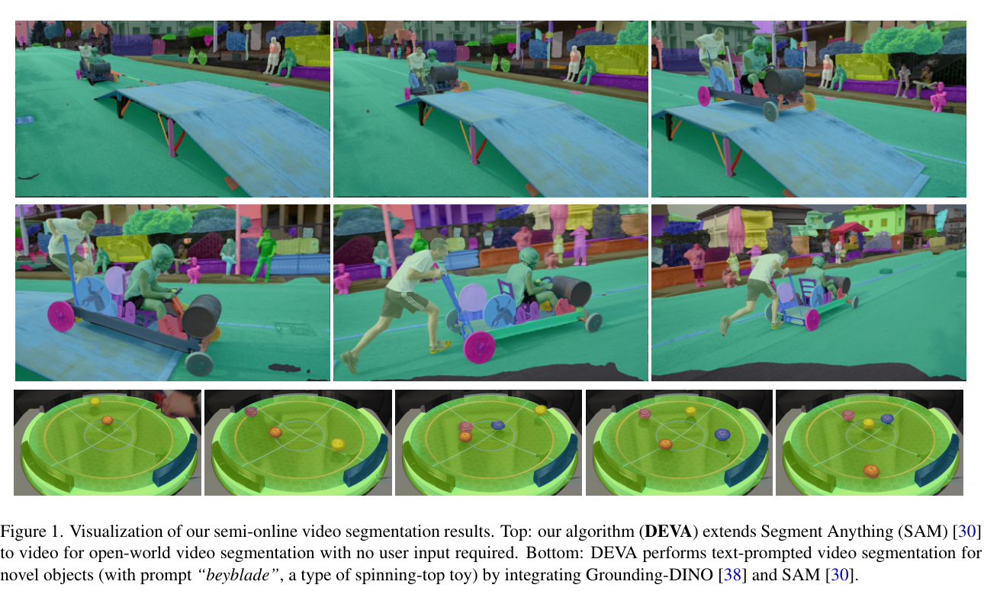
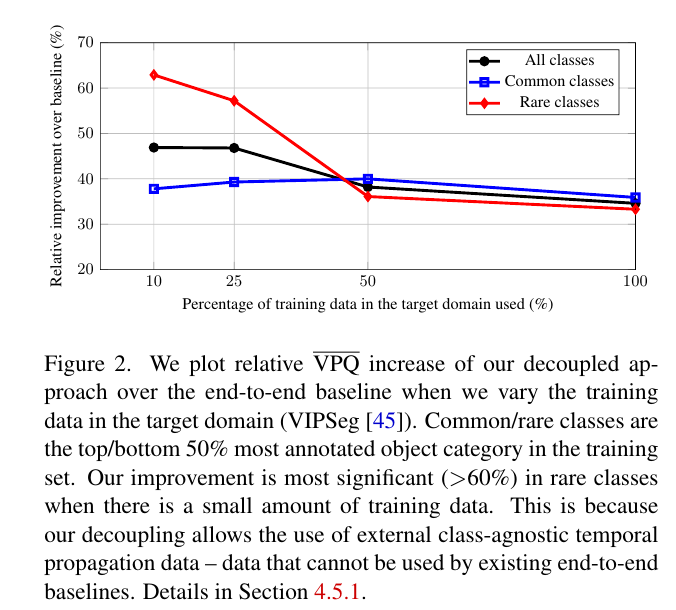

# Tracking Anything with Decoupled Video Segmentation

## 저널 및 학회 : ICCV 2023

## 저자 : 

[hkchengrex.github.io/ Tracking-Anything-with-DEVA.](https://hkchengrex.com/Tracking-Anything-with-DEVA/)
https://arxiv.org/abs/2309.03903


## Abstract :
- 비디오 분할을 위한 훈련 데이터는 주석을 달기(annotate)에 비용이 많이 듭니다. 
  - 이로 인해 대규모 어휘(large-vocabulary) 설정에서 종단간(end-to-end) 알고리즘을 새로운 비디오 분할 작업으로 확장하는 것이 어렵습니다.
  - 모든 개별 작업에 대한 비디오 데이터를 훈련시키지 않고 '모든 것을 추적하기' 위해, 우리는 작업 특정 이미지 수준 분할 (task-specific image-level segmentation)과 클래스/작업 중립적인(class/task-agnostic) 양방향 시간 전파를 포함하는 분리된 비디오 분할 접근법(decoupled video segmentation approach DEVA)을 개발했습니다.
  - 이 설계로 인해, 우리는 대상 작업을 위한 이미지 수준 모델(image-level model)만 필요로 합니다(이것은 훈련시키기에 더 저렴합니다) 그리고 일반적으로 작업 간에 일반화되는 유니버설 시간 전파(propagation) 모델이 한 번 훈련됩니다. 
  - 이 두 모듈을 효과적으로 결합하기 위해, 우리는 다양한 프레임의 분할 가설을 (반)온라인((semi-)online fusion)으로 융합하여 일관된 분할을 생성하기 위한 양방향 전파를 사용합니다. [(semi-)online fusion](./참고/semi%20online.md)
  - 우리는 이 분리된 형식이 대규모 어휘 비디오 판 세그먼트, 오픈 월드 비디오 세그먼트, 참조 비디오 세그먼트, 그리고 비감독 비디오 객체 세그먼트와 같은 데이터 부족 작업에서 종단간 접근법에 비해 유리하게 비교된다는 것을 보여줍니다.
  - [(VPQ) Video Panoptic Quality]()




## 1. Introduction
- 비디오 분할은 비디오 내의 객체를 분할하고 연결하는 것을 목표로 합니다. 
  - 이는 컴퓨터 비전에서의 기본적인 작업이며, 많은 비디오 이해 응용 프로그램에 있어 중요합니다.
  - 대부분의 기존 비디오 분할 접근법은 주석이 달린 비디오 데이터셋에서 종단간 비디오 수준 네트워크를 훈련시킵니다.
  - 이들은 YouTube-VIS [69]와 Cityscape-VPS [27]와 같은 일반적인 벤치마크에서 큰 발전을 이루었습니다. 
    - 그러나, 이 데이터셋들은 어휘가 작습니다: YouTube-VIS는 40개의 객체 카테고리를 포함하고 있으며, Cityscape-VPS는 19개만을 가지고 있습니다.
  - 최근의 end-to-end 패러다임이 대규모 어휘 또는 심지어 오픈 월드 비디오 데이터에 확장 가능한지에 대한 의문이 있습니다.
    - 최근에 larger vocabulary (124 클래스) 비디오 분할 데이터셋인 VIPSeg [45]는 더 어렵다고 밝혀졌습니다 - 동일한 백본을 사용하여, 최근의 방법 [34]은 CityscapeVPS에서 57.8 VPQ에 비해 26.1 VPQ만을 달성합니다. 
      - 우리의 지식으로는, 오픈 월드 설정을 위해 개발된 최근의 비디오 분할 방법들 [2, 39] (예: BURST [2])은 end-to-end이 아니며 프레임별 분할의 추적을 기반으로 합니다 - 이는 대규모 어휘 데이터셋에서의 종단간 훈련의 어려움을 더욱 강조합니다. 
        - 데이터셋 내의 클래스와 시나리오의 수가 증가함에 따라, 주석이 부족한 경우 특히, 분할과 연결을 공동으로 해결하기 위해 종단간 비디오 모델을 훈련시키고 개발하는 것이 더 어려워집니다.

- 이 작업에서는 목표 도메인 외부의 외부 데이터를 활용하여 목표 훈련 데이터에 대한 의존성(reliance)을 줄이려고 합니다. 
  - 이를 위해, 우리는 (task-specific) 작업 특정 이미지 수준 분할과 작업 중립적인 시간 전파를 결합하는 분리된 비디오 분할(decoupled video segmentation)을 연구하려고 합니다.
  - `task-specific : 도메인에 특화되지 않은, 즉 어떤 작업에도 적용될 수 있는 중립적인 도구나 방법`
  - 이러한 설계(design,)로 인해, 우리는 목표 작업을 위한 이미지 수준 모델(image-level model)만 필요로 합니다(이것은 비용이 덜 듭니다) 그리고 한 번 훈련되어 여러 작업에 일반화되는 유니버설 시간 전파 모델(universal temporal propagation model)이 필요합니다.
  - `시간에 따른 정보 전파를 처리하는 모델이 한 번만 훈련되어 다양한 작업에 적용될 수 있`
  -  '무엇이든 분할하라(segment anything)'(SAM) [30]와 같은 유니버설 프롬프터블 이미지 분할 모델과 다른 모델들 [76, 32, 24, 73, 74]이 최근에 사용 가능해졌으며, '무엇이든 추적하라track anything()' 파이프라인에서 이미지 수준 모델로서 탁월한 후보가 되었습니다. 
  -  그림 1은 이러한 방법과의 통합의 유망한 결과를 보여줍니다.


- 연구자들은 이전에 'tracking-by-detection' [26, 58, 3]로 알려진 분리된 형식을 연구해 왔습니다. 
  - 그러나 이러한 접근법들은 대개 이미지 수준의 탐지를 변경할 수 없다고 간주하며, 시간적 모델은 탐지된 객체만을 연결합니다. 
  - 이 형식은 이미지별 탐지의 품질에 크게 의존하며 이미지 수준의 오류에 민감합니다.


- 반대로, 우리는 1) 클립 내 합의를 통해 이미지 수준의 분할을 제거하고 (섹션 3.2.1), 
  - 2) 시간적 전파와 클립 내 합의의 결과를 우아하게 결합하기 위해 (semi-)online 양방향 전파(bi-directional propagation) 알고리즘을 개발합니다 (섹션 3.2.2).  
  - `"in-clip"은 해당 클립 내에서, 즉 그 작은 세그먼트나 부분 내에서 발생하는 것을 의미합니다. 원문의 맥락에서 "in-clip consensus"는 특정 비디오 클립 내에서 정보나 데이터의 일관성을 의미`
  - 이 양방향 전파(bi-directional propagation)는 이미지 수준 모델의 결과보다 시간적으로 더 일관성(coherent) 있고 잠재적으로 더 나은 결과를 허용합니다 (그림 2 참조).


-------


```
우리는 목표 도메인(VIPSeg [45])의 훈련 데이터를 변경할 때 종단간 기준에 비해 우리의 분리된 접근법의 상대적인 VPQ 증가를 그래프로 나타냈습니다. 공통/희귀(Common/rare) 클래스는 훈련 세트에서 가장 많이 주석이 달린 객체 카테고리의 상위/하위 50%입니다. 훈련 데이터가 적을 때, 우리의 개선은 희귀 클래스에서 가장 두드러지게 (>60%) 나타납니다. 이는 우리의 분리(decoupling)가 외부의 클래스 중립적인 시간 전파 데이터의 사용을 허용하기 때문입니다 – 이 데이터는 기존의 종단간(end-to-end) 기준에서는 사용될 수 없습니다. 세부 사항은 섹션 4.5.1에 있습니다.

```

[이해 잘 안되서 정리](./참고/설명1.md)

--------


- "우리는 종단간(end-to-end) 비디오 접근법을 대체하려는 것이 아닙니다.
  - 실제로, 충분한 비디오 수준의 훈련 데이터가 있는 비디오 작업에 특화된 프레임워크 (예: YouTubeVIS [69])가 개발된 방법보다 더 우수한 성능을 낸다는 것을 강조합니다. 
  - 대신, 이미지 모델은 사용 가능하지만 비디오 데이터가 부족할 때 우리의 분리된 접근법(decoupled approach)이 강력한 기준선으로 작용한다는 것을 보여줍니다. 
    - 이것은 큰 언어 모델의 사전 훈련 [52]과 마찬가지로, 특정 작업에 미세 조정되기 전에 자연어에 대한 작업 중립적인 이해가 가능하다는 것과 비슷한 정신입니다. 
      - 우리의 경우, 시간 전파 모듈(temporal propagation module)을 통해 비디오에서 클래스 중립적인 객체(ask-agnostic)의 분할 전파를 학습하고, 이 지식을 특정 작업에 적용하는 기술적 발전을 이룹니다. 
  - 제안된 분리된 접근법은 대규모(large-scale) 또는 오픈 월드 데이터셋(open-world datasets)에 잘 전송되며, 대규모 비디오 패노프틱 분할 (VIPSeg [45]) 및 오픈 월드 비디오 분할 (BURST [2])에서 최첨단 결과를 달성합니다. 
  - 또한 종단간(end-to-end training.) 훈련 없이 참조 비디오 분할 (Ref-YouTubeVOS [55], Ref-DAVIS [25]) 및 비감독 비디오 객체 분할 (DAVIS-16/17[5])에서 경쟁력 있게 수행됩니다.
  - [추가 설명2](./참고/설명2.md)

**summary**
- 우리는 분리된 비디오 분할(decoupled video segmentation)을 제안하는데, 이는 외부 데이터를 활용하여 종단간 비디오 접근법(end-to-end video approaches)보다 주석이 제한된 대상 작업에 더 잘 일반화됩니다. 또한, 이를 통해 SAM [30]과 같은 기존의 유니버설 이미지 분할 모델을 원활(seamlessly)하게 통합할 수 있습니다.
- 우리는 이미지 분할을 제거하고 시간적으로 전파된(temporally propagated) 분할과 우아하게 병합하는 양방향 전파를 개발했습니다.
- 우리는 경험적으로 우리의 접근법이 대규모 비디오 패노프틱 분할(video panoptic segmentation), 오픈 월드 비디오 분할, 참조 비디오 분할, 그리고 비감독(unsupervised) 비디오 객체 분할을 포함한 여러 중요한 작업에서 유리한 결과를 달성한다는 것을 보여줍니다.

